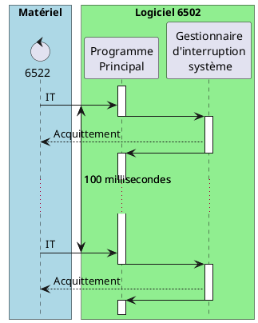

# OSME
Oric Sound and Music Engine

```plantuml
@startuml
!pragma teoz true
hide footbox
box "Matériel" #LightBlue
control "6522"
end box

box "Logiciel 6502" #LightGreen
participant "Programme\nPrincipal" as PP
participant "Gestionnaire\nd'interruption\n système" as HIS
end box

activate PP
{start} 6522 -> PP: IT
PP -> HIS: 
activate HIS
deactivate PP
HIS --> 6522: Acquittement
HIS -> PP
activate PP
deactivate HIS
|||
... ...
|||

{end} 6522 -> PP: IT
PP -> HIS: 
activate HIS
deactivate PP
HIS --> 6522: Acquittement
HIS -> PP
activate PP
deactivate HIS
{start} <-> {end} : 100 millisecondes
@enduml
```